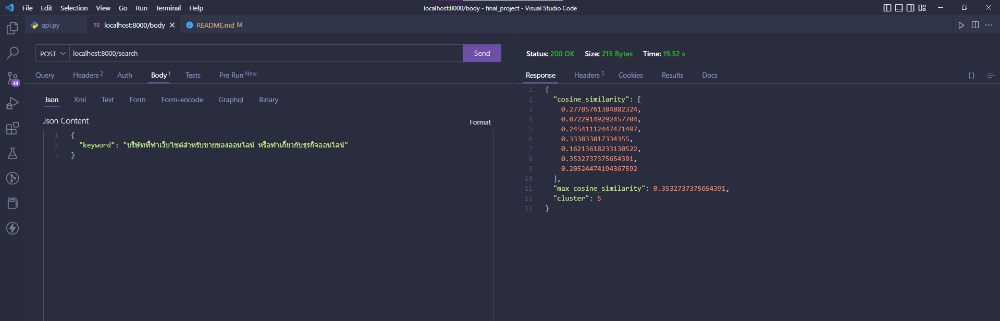

# Final project

🧑‍💻 เว็บไซต์แนะนำบริษัทสำหรับให้นักศึกษาหาสถานประกอบการณ์ฝึกงาน โดยค้นหาจากรูปแบบธุรกิจของบริษัท

## Group of companies

จัดกลุ่มใหม่จำนวน 7 กลุ่มอ้างอิงประเภทของงานไอทีจากเว็บไซต์ [Jobsdb](https://th.jobsdb.com/th/th/jobs/งานไอที/1)

## ประเภทงานด้านไอที

| ID  | Name             |
| --- | ---------------- |
| 0   | Data             |
| 1   | Other            |
| 2   | Online marketing |
| 3   | Software         |
| 4   | Hardware         |
| 5   | Network          |
| 6   | IT               |

### ตัวอย่างการจัดกลุ่มข้อมูลที่ข้อมูลแก้ไขคำผิดเช่น แพลทฟอร์ม => แพลตฟอร์ม

## 8 กลุ่ม


## 7 กลุ่ม


## 6 กลุ่ม


## Cosine similary

ผมใช้วิธีที่จะหาว่าคำตอบไหนจะเป็นคำตอบที่ดีที่สุดของการค้นหาด้วยวิธี Cosine similarity [อ้างอิง](https://www.softnix.co.th/2019/05/29/similarity-ความเหมือนที่แตกต่าง/)

**ตัวอย่างผลลัพธ์**

keyword: ออกแบบเว็บไซต์ด้วย react js ทำเกี่ยวกับการเขียนเว็บ การตลาดออนไลน์ด้วย และ SEO


จะเห็นว่าค่า Cosine similarity ของ cluster 2 นั้นมีมากกว่าก็จะคืนค่าผลลัพธ์บริษัทที่อยู่ใน cluster ที่ 2

## Search engine

เมื่อเรามีระบบที่วิเคราะห์ข้อมูล แบ่งกลุ่ม มีเว็บไซต์สำหรับใช้ค้นหา ก็ต้องมีช่องทางสำหรับการค้นหาผลลัพธ์ด้วย **API** ซึ่งในที่นี้มีระบบประมวลผลที่ใช้ Python จึงจะใช้ [**FastAPI**](https://fastapi.tiangolo.com/) เพื่อให้ครบจบในที่เดียว

_Demo_


Request **body**

```
{
    "keyword": "บริษัทที่ทำเว็บไซต์สำหรับขายของออนไลน์ หรือทำเกี่ยวกับธุรกิจ"
}
```

Response **Json**

```
{
  "cosine_similarity": [
    0.27785761384882324,
    0.07229149292457704,
    0.24541112447471497,
    0.333833817334355,
    0.16213618233130522,
    0.3532737375654391,
    0.20524474194367592
  ],
  "max_cosine_similarity": 0.3532737375654391,
  "cluster": 5
}
```



อย่างในตัวอย่างนี้ก็จะได้ผลลัพธ์กลับมาซึ่งจะใช้ค่าจาก cluster มาให้เว็บไซต์ไปดึงข้อมูลจากบริษัทที่อยู่ในกลุ่มที่ 5 ออกมาแสดงผลลัพธ์

---

## License

MIT
