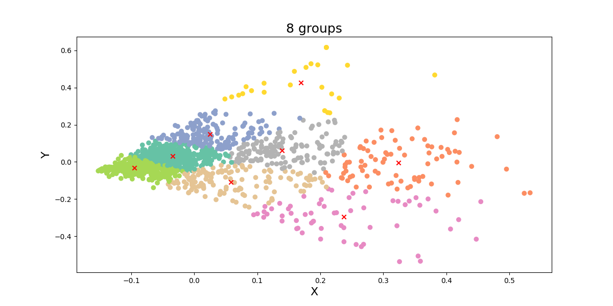
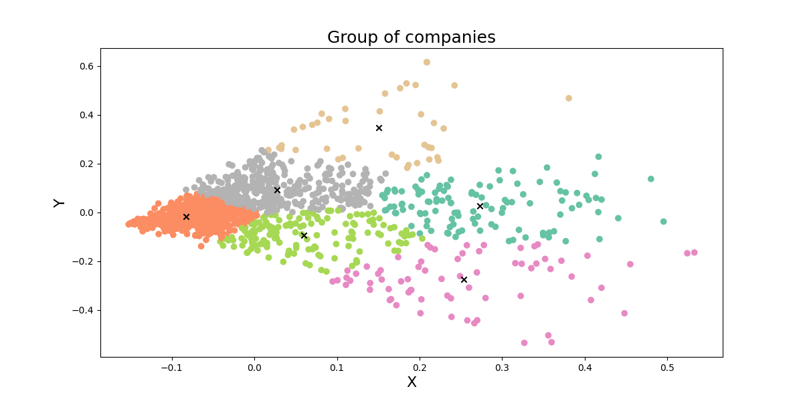

# Final project

🧑‍💻 เว็บไซต์แนะนำบริษัทสำหรับให้นักศึกษาหาสถานประกอบการณ์ฝึกงาน โดยค้นหาจากรูปแบบธุรกิจของบริษัท

## Group of companies

จัดกลุ่มใหม่จำนวน 7 กลุ่มอ้างอิงประเภทของงานไอทีจากเว็บไซต์ [Jobsdb](https://th.jobsdb.com/th/th/jobs/งานไอที/1)

## ประเภทงานด้านไอที

| ID  | Name             |
| --- | ---------------- |
| 0   | Data             |
| 1   | Other            |
| 2   | Online marketing |
| 3   | Software         |
| 4   | Hardware         |
| 5   | Network          |
| 6   | IT               |

### ตัวอย่างการจัดกลุ่มข้อมูลที่ข้อมูลแก้ไขคำผิดเช่น แพลทฟอร์ม => แพลตฟอร์ม

## 8 กลุ่ม

## 7 กลุ่ม

## 6 กลุ่ม

## Cosine similary

ผมใช้วิธีที่จะหาว่าคำตอบไหนจะเป็นคำตอบที่ดีที่สุดของการค้นหาด้วยวิธี Cosine similarity [อ้างอิง](https://www.softnix.co.th/2019/05/29/similarity-ความเหมือนที่แตกต่าง/)

**ตัวอย่างผลลัพธ์**

keyword: ออกแบบเว็บไซต์ด้วย react js ทำเกี่ยวกับการเขียนเว็บ การตลาดออนไลน์ด้วย และ SEO

จะเห็นว่าค่า Cosine similarity ของ cluster 2 นั้นมีมากกว่าก็จะคืนค่าผลลัพธ์บริษัทที่อยู่ใน cluster ที่ 2

---

## License

MIT
