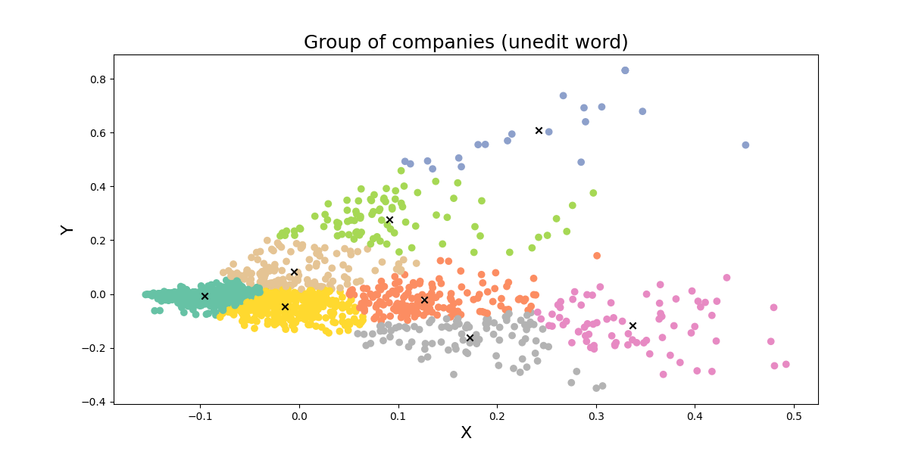
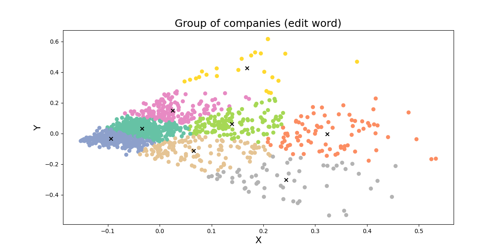

## Group of companies

จัดกลุ่มใหม่จำนวน 8 กลุ่มอ้างอิงประเภทของงานไอทีจากเว็บไซต์ [Jobsdb](https://th.jobsdb.com/th/th/jobs/งานไอที/1)

## ประเภทงานด้านไอที

| #   | Name             |
| --- | ---------------- |
| 1   | AI               |
| 2   | Data             |
| 3   | IT               |
| 4   | Network          |
| 5   | Online marketing |
| 6   | Other            |
| 7   | Software         |
| 8   | UX/UI designer   |

## การทดลองวัดค่าความแม่นยำในการตัดคำของ Engine ใน Pythainlp

> 🚨 การทดลองวัดค่าความแม่นยำนี้เป็นการกำหนดวิธีการเองซึ่งอาจไม่ได้ถูกต้องตามหลัก กระทู้เกี่ยวกับการวัดค่าความแม่นยำของแต่ละ engine ใน **Pythainlp** ได้มีการตั้งไว้แล้วสามารถอ่านได้ [ที่นี่](https://github.com/PyThaiNLP/pythainlp/issues/62)

**Solution**

1. สุ่มข้อมูลมา 100 ชุด
2. ทำการตัดคำในแต่ละข้อความเองโดยไม่ใช้ตัวช่วย
3. ใช้ engine ใน Pythainlp ตัดข้อความให้
4. เขียนโปรแกรมเปรียบเทียบและนับคะแนนข้อความที่ใช้ Pythainlp ตัดโดยยึดจากที่ตัดเองเป็นหลักว่าถูกต้อง

**Engine**

- newmm
- deepcut
- longest

**Accuracy**

| Engine  | Accuracy (%) |
| ------- | ------------ |
| newmm   | 90.99%       |
| deepcut | 76.65%       |
| longest | 83.04%       |

## การทดลองจัดกลุ่มของข้อมูล

> 📌 จัดกลุ่มข้อมูลไว้ทั้งหมดจำนวน 8 กลุ่มดังที่ระบุไปข้างบนและตัวเลขในคอลัมน์ # เป็นเพียงลำดับเท่านั้นไม่ใช่ Cluster label

ปัญหาที่พบตอนนี้คือข้อมูลที่เป็นคำที่สะกดผิดเช่น **แอพพลิเคชั่น/แอปพลิเคชั่น/แอพลิเคชั่น** อยู่คนละกลุ่มกันกับคำที่สะกดถูกอย่าง **แอปพลิเคชัน** ทำให้การจัดกลุ่มนั้นได้ผลลัพธ์ที่มีความผิดเพี้ยนอยู่พอสมควร จึงได้ทำการทดลองในกรณีเพิ่มเติมขึ้นมาเพื่อเปรียบเทียบผลลัพธ์

**กรณีการทดลอง**

1. ใช้ข้อมูลเดิมที่มีคำผิด
2. แก้ไขคำที่ผิดให้มากที่สุด

**ผลการทดลอง**

1. กรณีที่ไม่ได้มีการแก้คำผิด พบว่า การจัดกลุ่มของข้อมูลนั้นมีบางกลุ่มที่มีคีย์เวิร์ดปนกันอยู่เนื่องจากอัลกอริทึมมองว่าคำอื่นในประโยคนั้นมีน้ำหนักมากกว่า ดังรูป
   
2. กรณีมีการแก้คำผิดให้มากที่สุดก่อนจัดกลุ่ม พบว่า การจัดกลุ่มมีความแม่นยำมากยิ่งขึ้นแต่ยังมีบางประโยคที่ปนกันกับกลุ่มอื่นๆ เล็กน้อย ดังรูป
   

---

## License

MIT
