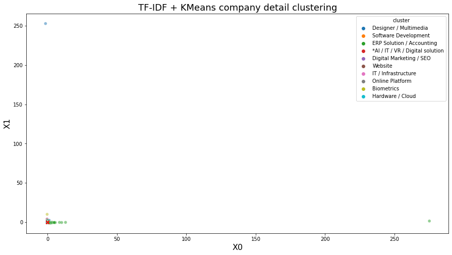
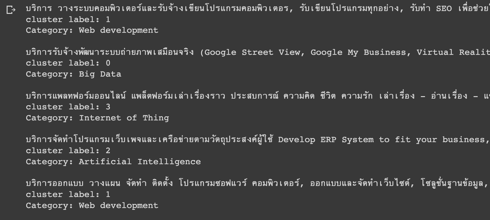

# Final project

🧑‍💻 แนะนำบริษัทตามความต้องการด้วยการค้นหาโดยใช้ NLP มาช่วยในการพัฒนาเป็นโปรเจคจบป.ตรี

## ตัวอย่างการหาคีย์เวิร์ด

ตัวอย่างผลลัพธ์หาคีย์เวิร์ดด้วยวิธีหาค่า TF-IDF จากทั้งหมด 1600+ กว่าประโยค

## ทดลองทำ Text clustering

นำผลลัพธ์การทดลองที่หาค่า TF-IDF มาทำ Cluster จำนวน 4 กลุ่ม

## ตัวอย่างแสดงประเภทธุรกิจของบริษัท

> 🚨 Category ดังกล่าวเป็นเพียงตัวอย่างเท่านั้นยังไม่ได้ปรับปรุงให้ตรงกับข้อมูลมากที่สุด

**Category**

| ID  | Name                    |
| --- | ----------------------- |
| 0   | Big data                |
| 1   | Web development         |
| 2   | Artificial Intelligence |
| 3   | Internet of Thing       |

## License

MIT
