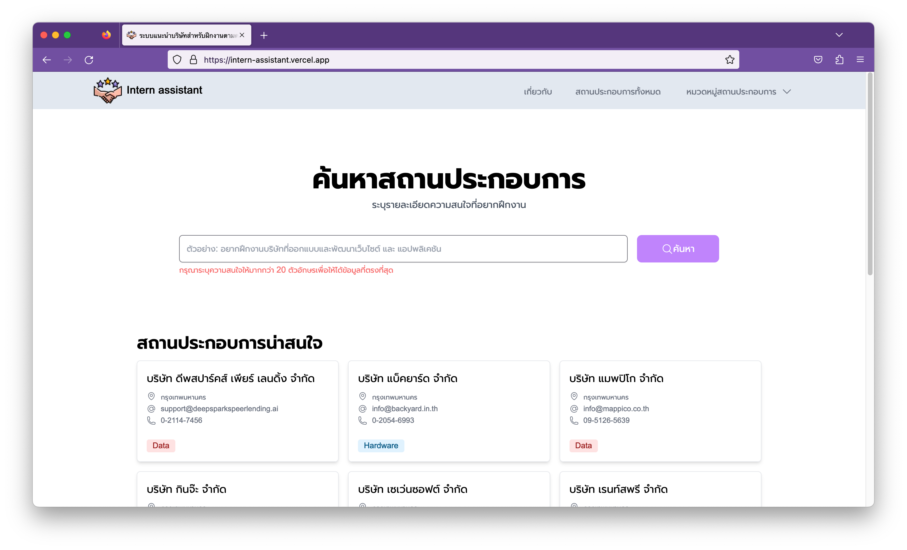
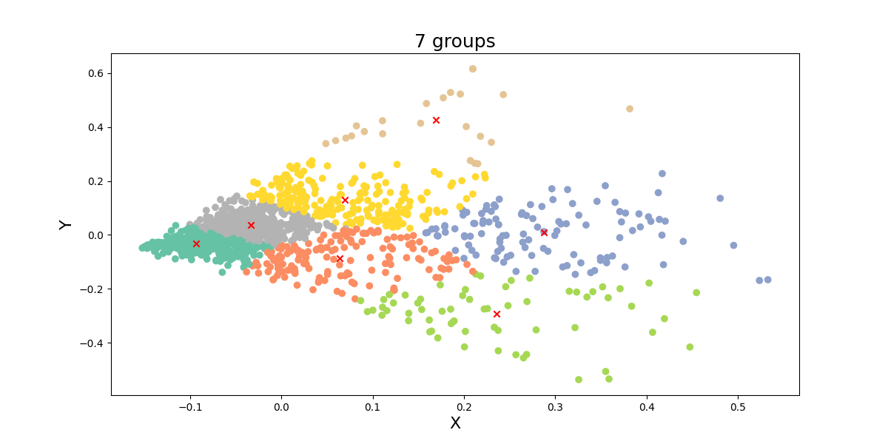
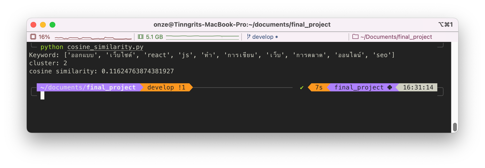
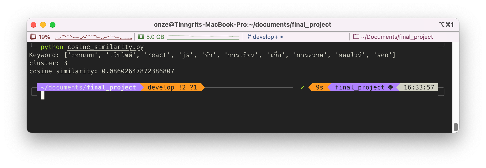
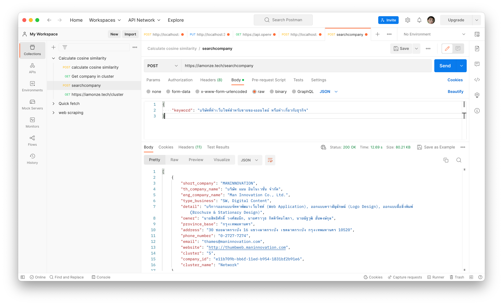
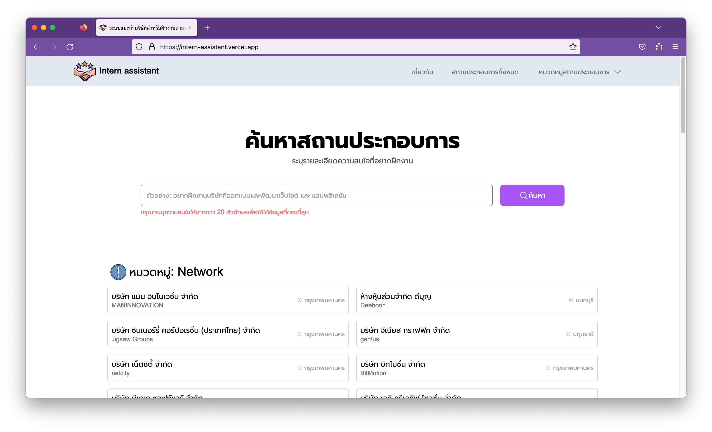

# ระบบแนะนำสถานที่ฝึกงานด้านคอมพิวเตอร์ ด้วยเทคโนโลยีการจัดกลุ่มเคมีน (Computer Internship Recommendation System With K-Means Clustering)

## **เล่าคร่าวๆ**

โปรเจคนี้เป็นการนำเอาข้อมูลบริษัทที่ทำธุรกิจด้านคอมพิวเตอร์และเทคโนโลยีจาก**สมาคมปัญญาประดิษฐ์แห่งประเทศไทย** มาทำการวิเคราะห์และจัดกลุ่มด้วย K-Means Clustering จากนั้นพัฒนาเว็บแอปพลิเคชันเพื่อให้ผู้ใช้ระบุความสนใจหรือรูปแบบธุรกิจที่อยากฝึกงาน และนำความสนใจของผู้ใช้หาความคล้ายคลึงกับข้อมูลบริษัทในฐานข้อมูลด้วยเทคนิค Cosine similarity



---

## **Flow การพัฒนาระบบ**

**Data Mining**

1. เริ่มจากการทำความสะอาดข้อมูล
2. ทำ Word segmentation ข้อมูลโดยใช้การหาคีย์เวิร์ดของแต่ละประโยคโดยใช้ TF-IDF
3. แบ่งกลุ่มข้อมูลด้วย K-Means clustering
4. Export ข้อมูลไปใช้

**Application**

1. พัฒนา Web Application ด้วย Next.js สำหรับรับค่าความสนใจรูปแบบงานของผู้ใช้
2. พัฒนา API สำหรับคำนวณค่าความคล้ายคลึง Cosine similarity

---

## **Flow การทำงาน**

1. ผู้ใช้ระบบความสนใจรูปแบบธุรกิจที่ต้องการฝึกงาน
2. ส่งรายละเอียดไปปคำนวณค่าความคล้ายคลึงที่ Cosine similarity API
3. นำผลลัพธ์ที่เป็น Cluster ID ไปค้นหาบริษัทที่อยู่ในกลุ่ม Cluster ID นั้น
4. ส่งค่ากลับมาเป็นรายชื่อบริษัทมาแสดงผลหน้าเว็บ

## **การแบ่งกลุ่มบริษัท**

จำนวน 7 กลุ่มอ้างอิงประเภทของงานไอทีจากเว็บไซต์ [Jobsdb](https://th.jobsdb.com/th/th/jobs/งานไอที/1)

## ประเภทงานด้านไอที

| ID  | Name             |
| --- | ---------------- |
| 1   | Data             |
| 2   | Other            |
| 3   | Online marketing |
| 4   | Software         |
| 5   | Hardware         |
| 6   | Network          |
| 7   | IT               |

**ตัวอย่างการจัดกลุ่มข้อมูล**

## 7 กลุ่ม



## Cosine similary

ผมใช้วิธีที่จะหาว่าคำตอบไหนจะเป็นคำตอบที่ดีที่สุดของการค้นหาด้วยวิธี Cosine similarity [อ้างอิง](https://www.softnix.co.th/2019/05/29/similarity-ความเหมือนที่แตกต่าง/)

**ตัวอย่างผลลัพธ์**

keyword: ออกแบบเว็บไซต์ด้วย react js ทำเกี่ยวกับการเขียนเว็บ การตลาดออนไลน์ด้วย และ SEO



จะเห็นว่าค่า Cosine similarity ของ cluster 2 นั้นมีมากกว่าก็จะคืนค่าผลลัพธ์บริษัทที่อยู่ใน cluster ที่ 2

## **Cosine similarity API**

เมื่อเรามีระบบที่วิเคราะห์ข้อมูล แบ่งกลุ่ม มีเว็บไซต์สำหรับใช้ค้นหา ก็ต้องมีช่องทางสำหรับการค้นหาผลลัพธ์ด้วย **API** ซึ่งในที่นี้มีระบบประมวลผลที่ใช้ Python จึงจะใช้ [**FastAPI**](https://fastapi.tiangolo.com/) เพื่อให้ครบจบในที่เดียว

**version: 1**


Request **body**

```bash
{
    "keyword": "บริษัทที่ทำเว็บไซต์สำหรับขายของออนไลน์ หรือทำเกี่ยวกับธุรกิจ"
}
```

Response **Json**

```bash
{
  "cosine_similarity": [
    0.27785761384882324,
    0.07229149292457704,
    0.24541112447471497,
    0.333833817334355,
    0.16213618233130522,
    0.3532737375654391,
    0.20524474194367592
  ],
  "max_cosine_similarity": 0.3532737375654391,
  "cluster": 5
}
```

อย่างในตัวอย่างนี้ก็จะได้ผลลัพธ์กลับมาซึ่งจะใช้ค่าจาก cluster มาให้เว็บไซต์ไปดึงข้อมูลจากบริษัทที่อยู่ในกลุ่มที่ 5 ออกมาแสดงผลลัพธ์

**version: 2**


Request **body**

```bash
{
    "keyword": "บริษัทที่ทำเว็บไซต์สำหรับขายของออนไลน์ หรือทำเกี่ยวกับธุรกิจ"
}
```

Response **Json**

ในเวอร์ชันที่ 2 นี้เพื่มฟังก์ชันการค้นหานอกจากจะคืนค่าเป็น Cluster ID แล้วนั่นเปลี่ยนเป็นคืนค่าเป็นข้อมูลบริษัทแทน

## **ทดลองใช้งาน**

เมื่อส่วนประกอบต่างๆ ครบแล้วก็มาลองใช้งานกันด้วยคีย์เวิร์ดเดียวกับ Demo


---

## License

MIT
